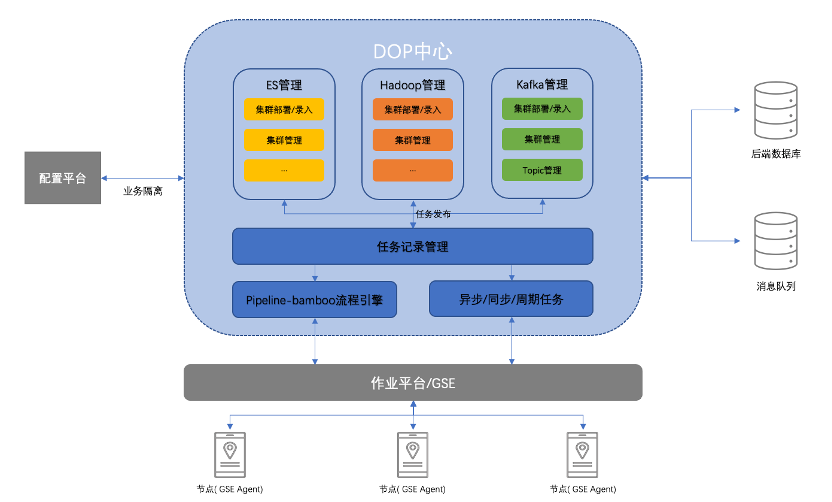

## 1. SaaS 简介
### 产品介绍

DOP是一个基于蓝鲸智云开发的数据管理工具，旨在简化各类大数据组件的日常运维操作、降低使用门槛、提高运维效率，目前支持Elasticsearch、Kafka、Hadoop。

### 产品架构

### 产品首页

## 2. 本地环境部署

- [本地环境部署操作指南](./docs/dev_deploy.md)

## 3. 正式环境部署

- [正式环境部署操作指南](./docs/prod_deploy.md)

## 4. 平台操作指南
- [操作文档](./docs/v1_peration.md)

