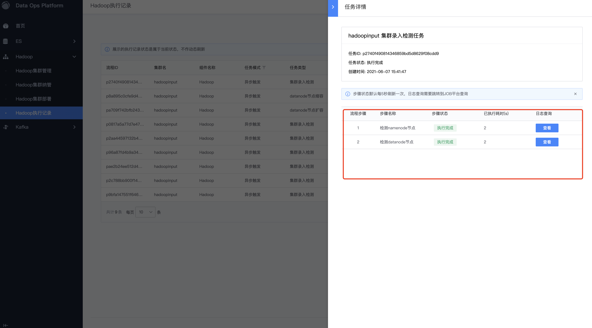
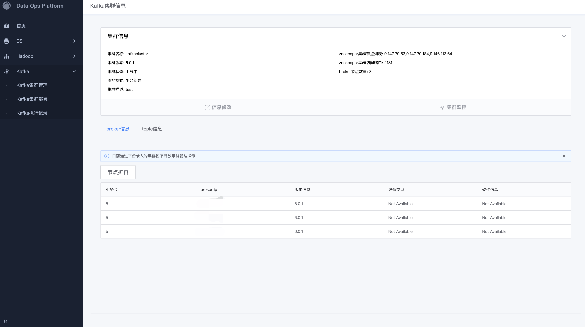
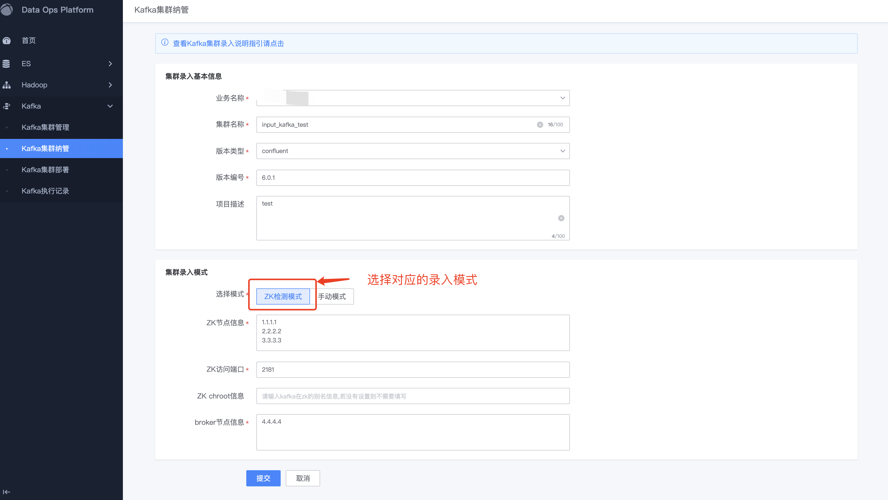

* [快速入门](#快速入门)
   * [ES快速入门](#ES-快速入门)
      * [ES部署](#ES部署)
      * [ES纳管](#ES纳管)
   * [Hadoop快速入门](#Hadoop-快速入门)
      * [Hadoop部署](#Hadoop部署)
      * [Hadoop纳管](#Hadoop纳管)
   * [Kafka 快速入门](#Kafka-快速入门)
      * [Kafka部署](#Kafka部署)
      * [Kafka纳管](#Kafka纳管)
* [功能介绍](#功能介绍)
   * [ES模块功能介绍](#ES模块功能介绍)
      * [ES集群管理](#ES集群管理)
      * [ES集群纳管](#ES集群纳管)
      * [ES集群部署](#ES集群部署)
      * [ES集群扩容](#ES集群扩容)
      * [ES集群缩容](#ES集群缩容)
      * [ES执行记录](#ES执行记录)
   * [Hadoop模块功能介绍](#Hadoop模块功能介绍)
      * [Hadoop集群管理](#Hadoop集群管理)
      * [Hadoop集群纳管](#Hadoop集群纳管)
      * [Hadoop集群部署](#Hadoop集群部署)
      * [Hadoop集群扩容](#Hadoop集群扩容)
      * [Hadoop集群缩容](#Hadoop集群缩容)
      * [Hadoop执行记录](#Hadoop执行记录)
   * [Kafka模块功能](#Kafka模块功能)
      * [Kafka集群管理](#Kafka集群管理)
      * [Kafka集群部署](#Kafka集群部署)
      * [Kafka集群扩容](#Kafka集群扩容)
      * [Kafka topic创建](#topic创建)
      * [Kafka执行记录](#Kafka执行记录)
   * [整合日志平台](#整合日志平台)
      * [ES日志整合](#ES日志整合)
      * [Hadoop日志整合](#Hadoop日志整合)
      * [Kafka日志整合](#Kafka日志整合)
      
# 快速入门

## ES 快速入门

### ES部署

**集群部署**：是根据用户填写的信息，已原生的cluster模式，部署一套es高可用集群。综合考虑，目前平台针对es部署集群分 为混部模式和独立模式，混部模式最小规格为1台机器，适合在开发环境选择部署；而独立模式的最小规模规模是5个节点：（3个master角色，2个data角色），适合在生产环境选择部署。

**前置条件** ：需要至少准备1台（混部模式）或者准备5台（独立模式）独立机器(已部署gse agent，没有部署过es进程)。

部署集群参数说明（带\*必填）：

| **参数名称** | **参数说明** | **备注** |
| --- | --- | --- |
| 业务名称\* | 创建集群时绑定业务名称 | 可选业务名称列表是根据用户的配置平台的权限同步 |
| 集群名称\* | 创建集群时指定的集群名称 | 平台唯一 |
| ES HTTP端口\* | 创建集群时指定的ES集群访问的HTTP端口 | 端口范围1-65535 默认端口9200，可修改 |
| 版本选择\* | 平台目前提供的版本选择 | 暂不增加 |
| 集群模式\* | 平台目前提供能部署集群的模式 | 支持混部模式和独立模式，用户可根据自己需求来选择适合的部署模式。 |
| Master node\* | 填写对应的集群master 角色的IP信息列表 | 暂不支持混合部署，不能重复。多个用隔开符隔开，支持的隔开符：空格、空行、英文逗号|
| Data node\* | 填写对应的集群data角色的IP信息列表 | 暂不支持混合部署，不能重复。多个用隔开符隔开，支持的隔开符：空格、空行、英文逗号 |
| Cold node | 填写对应的集群cold data 角色的IP信息列表 | 暂不支持混合部署，不能重复。多个用隔开符隔开，支持的隔开符：空格、空行、英文逗号 |
| Client node | 填写对应的集群client data 角色的IP信息列表 | 暂不支持混合部署，不能重复。多个用隔开符隔开，支持的隔开符：空格、空行、英文逗号 |
| 用户名\* | 创建集群时指定的初始化用户信息 |
| 密码\* | 创建集群时指定的初始化用户密码信息 |
| 项目描述 | 填写集群的场景描述 |

跳转ES执行记录页面可看到部署集群的运行状态

点击详情可查看任务的进度情况

部署成功之后跳转到ES集群信息，可以看ES部署信息。

选择对应集群信息操作属性的&quot;集群详情&quot;，则可查看集群的详细信息

### ES纳管

**集群纳管** ：如果用户已存在一套的ES集群，可以通过录入的方式将集群给平台进行托管。（注意：目前版本由于考虑到兼容性问题，纳管的集群暂时屏蔽ES的管理功能，如扩缩容等。V2.0版本将开放，敬请期待）

**前置条件** ：保证待纳管es集群是健康集群，并部署job平台的gse agent

纳管集群参数说明（带\*必填）

| **参数名称** | **参数说明** | **备注** |
| --- | --- | --- |
| 业务名称\* | 选择待纳管集群时对应的业务名称 | 可选业务名称列表是根据用户的配置平台的权限同步 |
| 集群名称\* | 选择待纳管集群时指定的集群名称 | 平台唯一 |
| ES集群httpUrl\* | 选择待纳管集群http访问地址 | 非域名链接输入，获取es集群状态信息 |
| 集群版本\* | 选择待纳管集群时es版本代号 | 手动纳管，格式为x.x.x |
| 用户名 | 若待纳管集群时存在root用户信息，填写指定用户信息 |
| 密码 | 若待纳管集群时存在root用户信息，填写指定用户密码信息 |
| 项目描述 | 填写集群的场景描述 |

选择ES纳管集群信息，填写对应信息。

跳转ES执行记录页面可看到部署纳管的运行状态

点击详情可查看任务的进度情况

部署成功之后跳转到ES集群信息，可以看ES纳管信息。

选择对应集群信息操作属性的&quot;集群详情&quot;，则可查看集群的详细信息

## Hadoop 快速入门

### Hadoop部署
**集群部署**：根据用户对Hadoop生态的需求，填写对应的部署信息，部署一套Hadoop集群（目前V1.0版本只支持hdfs和 yarn组件部署，hdfs部署信息是必填的，未来版本增加更多的Hadoop生态组件，敬请期待）

**前置条件**：需要至少准备3台独立机器(已部署gse agent，没有部署过hdfs和 yarn进程)，机器可混合部署进程

部署集群参数说明（带\*必填）：

| **参数名称** | **参数说明** | **备注** |
| --- | --- | --- |
| 业务名称\* | 创建集群时绑定业务名称 | 可选业务名称列表是根据配置平台同步 |
| 集群名称\* | 创建集群时指定的集群名称 | 平台唯一 |
| 版本选择\* | 平台目前提供的版本选择 | 暂不增加 |
| hdfs数据目录\* | 填写hdfs的数据目录列表 | 可填写多个，若不存在则部署自动创建 |
| Hdfs副本数量\* | 填写对应的hdfs的副本数量 | 数量范围 1-3 |
| ssh远程端口\* | 填写机器的远程端口号 | 需要做用户免认证，必须每台机器的远程端口是一致 |
| NN 节点信息\* | 填写集群namenode IP信息 | 机器可混合进程部署，必须在平台新输入，不能与StandbyNameNode一致。 多个用隔开符隔开，支持的隔开符：空格、空行、英文逗号 |
| SNN 节点信息\* | 填写集群StandbyNameNode IP信息 | 机器可混合进程部署，必须在平台新输入，不能与namenode一致。多个用隔开符隔开，支持的隔开符：空格、空行、英文逗号|
| DN 节点信息\* | 填写集群DataNode IP信息 | 机器可混合进程部署，必须在平台新输入，机器数量不能少于副本数量。多个用隔开符隔开，支持的隔开符：空格、空行、英文逗号 |
| JN 节点信息\* | 填写集群JournalNode IP信息 | 机器可混合进程部署，必须在平台新输入，机器数量必须等于3台。多个用隔开符隔开，支持的隔开符：空格、空行、英文逗号 |
| ZooKeeper 访问端口\* | 填写集群Zookeeper访问端口 | 目前不能更改，只能配置2181 |
| ZooKeeper 节点信息\* | 填写集群ZookeeperNode IP信息 | 机器可混合进程部署，必须在平台新输入，机器数量必须等于3台。多个用隔开符隔开，支持的隔开符：空格、空行、英文逗号 |
| 是否部署YARN集群\* | 选择是否部署YARN集群 ||
| RM 节点信息 | 填写集群ResourceManagerNode IP信息 | 机器可混合进程部署，必须在平台新输入，机器数量必须等于2台。多个用隔开符隔开，支持的隔开符：空格、空行、英文逗号|
| NM 节点信息 | 填写集群NodeManagerNode IP信息 | 机器可混合进程部署，必须在平台新输入，前提ResourceManagerNode有部署信息。 多个用隔开符隔开，支持的隔开符：空格、空行、英文逗号|

进入hadoop集群部署页面，根据提示填写对应的部署信息，部署对应集群

进入hadoop执行记录后，可查看刚才的部署信息

点击详情可查看任务的进度情况

部署任务执行完成之后，进入Hadoop集群信息，可查看部署后的集群信息状态（每个用户的查询信息是根据配置平台的权限而显示对应集群信息）

点击操作栏的&quot;集群详情&quot;可看到集群的详细情况

### Hadoop纳管

**集群纳管**：如果用户已存在对应的Hadoop集群，可以通过纳管的方式将集群给平台进行托管。（注意：目前版本由于考虑到兼容性问题，纳管的集群暂时屏蔽Hadoop的管理功能，如扩缩容等。V2.0版本将开放，敬请期待）

**前置条件** ：保证填写的集群信息是正确的，保证待纳管hadoop集群是健康集群。

纳管集群参数说明（带\*必填）：

| **参数名称** | **参数说明** | **备注** |
| --- | --- | --- |
| 业务名称\* | 选择待纳管集群时绑定业务名称 | 可选业务名称列表是根据用户的配置平台的权限同步 |
| 集群名称\* | 选择待纳管集群时指定的集群名称 | 平台唯一 |
| 版本选择\* | 选择待纳管集群时平台目前提供的版本选择信息 | 暂不能增加，目前只支持2.6.0/3.2.0/other(代表其他版本号) |
| 集群启动账号\* | 填写待纳管集群时启动进程账号 |
| 集群安装目录\* | 填写待纳管集群时集群安装目录 |
| ssh远程端口\* | 填写待纳管集群机器的远程端口号 |
| 域名映射关系 | 填写待纳管集群机器的IP和域名的对应关系 | 输入格式： ip/dnsname， 多个用隔开符隔开，支持的隔开符：空格、空行、英文逗号 |
| hdfs数据目录\* | 填写待纳管集群的hdfs的数据目录列表 | 可填写多个，用逗号或者空格隔开 |
| Hdfs副本数量\* | 填写待纳管集群的hdfs的副本数量 |
| NN 节点信息\* | 填写待纳管集群namenode IP信息 | 
| DN 节点信息\* | 填写待纳管集群DataNode IP信息 | 多个用隔开符隔开，支持的隔开符：空格、空行、英文逗号 |
| 是否有配置SNN节点 | 选择是否有有配置SNN节点 |
| SNN 节点信息 | 填写待纳管集群StandbyNameNode IP信息 | 有且只有一个SNN节点。若没部署则无需填写 |
| 是否有配置JN节点 | 选择是否有配置JN节点 |
| JN 节点信息 | 填写待纳管集群JournalNode IP信息 |多个用隔开符隔开，支持的隔开符：空格、空行、英文逗号。 若没部署则无需填写 |
| 是否有部署ZK集群 | 选择是否填入zk集群 |
| ZK 访问端口 | 填写待纳管集群ZookeeperNode 访问端口信息 | 正确的端口号 |
| ZK 节点信息 | 填写待纳管集群ZookeeperNode IP信息 | 多个用隔开符隔开，支持的隔开符：空格、空行、英文逗号。 若没部署则无需填写 |
| 是否部署YARN集群 | 选择是否填入YARN集群 |
| RM 节点信息 | 填写待纳管集群ResourceManagerNode IP信息 | 多个用隔开符隔开，支持的隔开符：空格、空行、英文逗号。 若没部署则无需填写 |
| NM 节点信息 | 填写待纳管集群NodeManagerNode IP信息 | 多个用隔开符隔开，支持的隔开符：空格、空行、英文逗号。若没部署则无需填写 |
| 是否有配置HDFS的节点上线策略 | 选择是否填入HDFS的节点上线策略 | |
| Hdfs白名单路径 | 填写待纳管集群机器的hdfs 的白名单配置信息 | 需要正确的绝对路径 |
| Hdfs黑名单路径 | 填写待纳管集群机器的hdfs 的黑名单配置信息 | 需要正确的绝对路径 |

进入hadoop集群纳管页面，根据提示填写对应的纳管信息，纳管对应集群

填写无误后则点击&quot;提交&quot;

进入hadoop执行记录后，可查看刚才的录入信息

点击详情可查看任务的进度情况

纳管任务执行完成之后，进入Hadoop集群信息，可查看纳管后的集群信息状态（每个用户的查询信息是根据配置平台的权限而显示对应集群信息）

点击操作栏的&quot;集群详情&quot;可看到集群的详细情况

## Kafka 快速入门

### Kafka部署

**集群部署**：是根据用户填写的信息，部署一套kafka高可用集群。综合考虑，目前平台kafka部署集群的最小规模是3个节点，不能混部署

**前置条件** ：至少需要3台独立机器（已部署好 gse agent，没有启动kafka和zookeeper的进程）

部署集群参数说明（带\*必填）：

| **参数名称** | **参数说明** | **备注** |
| --- | --- | --- |
| 业务名称\* | 创建集群时绑定业务名称 | 可选业务名称列表是根据用户的配置平台的权限同步 |
| 集群名称\* | 创建集群时指定的集群名称 | 平台唯一 |
| 版本选择\* | 平台目前提供的版本选择 | 暂不增加 |
| Broker节点信息\* | 填写集群每个broker的IP信息 | 多个用隔开符隔开，支持的隔开符：空格、空行、英文逗号 |
| 项目描述 | 填写集群的场景描述 |

进入kafka执行记录后，可查看刚才的部署信息

点击详情可查看任务的进度情况

部署完成之后，进入集群信息查询，既可查询到当前集群信息

点击集群详情，可看到对应的broker和topic信息

### Kafka纳管

**集群纳管**：如果用户有已存在对应的Kafka集群，可以通过纳管的方式将集群给平台进行托管。目前对于Kafka纳管提供两种方式：ZK检测模式和手动模式（注意：目前版本由于考  虑到兼容性问题，纳管的集群暂时屏蔽Kafka的管理功能，如扩缩容等。V2.0版本将开放，敬请期待）

**前置条件**：保证填入的信息无误

纳管集群参数说明（带*必填）：

|**参数名称**	|**参数说明**	|**备注**|
| --- | --- | --- |
|业务名称\*	|纳管集群时绑定业务名称	|可选业务名称列表是根据用户的配置平台的权限同步|
|集群名称\*	|纳管集群时指定的集群名称	|平台唯一|
|版本类型\*	|平台目前提供的版本类型选择，目前支持Apache和 confluent 类型	|根据自身Kafka集群的发行公司做对应的选择|
|项目描述	|填写集群的场景描述|	
|选择模式\*	|选择对应的纳管模式，目前提供ZK检测模式和手动模式	|
|ZK节点信息\*|	填入注册kafka集群的ZK节点信息	|信息尽量全且无误，当选择ZK检测模式是必选参数|
|ZK 访问端口\*|	填入注册kafka集群的ZK 访问端口信息|	信息尽量全且无误，当选择ZK检测模式是必选参数|
|ZK chroot信息|	填入注册kafka集群的ZK chroot信息|	若没有配置则无需填写|
|Broker信息\*|	填入kafka集群的broker信息	|如果选择ZK检测模式，则填写其中一个即可；若如果选择手动模式，则需要填写全部信息。多个borker需要用空行或者英文逗号隔开|
|Topic信息|	填入kafka集群已存在的topic信息	|若没有配置则无需填写|

	

进入Kafka执行记录后，可查看刚才的部署信息

	

点击详情可查看任务的进度情况

	

纳管完成之后，进入集群信息查询，既可查询到当前集群信息

	

点击集群详情，可看到对应的broker和topic信息

		

# 功能介绍

## ES模块功能介绍

### ES集群管理

功能概述：提供ES集群查询功能，用户在查询时是基于根据在配置平台拥有的业务权限来返回对应集群信息（若用户没有任何业务的权限，则显示为空）

管理功能列表：搜索功能、导出数据功能、集群详情（查询集群内部的详细进程部署信息，集群扩缩容的能力等）

参数说明：无

### ES集群纳管

功能概述：提供纳管ES集群信息功能，适配后由平台来管控非平台创建的ES集群(注意：目前版本由于考虑到兼容性问题，纳管的集群暂时屏蔽的管控功能，如扩缩容等。V2.0版本将开放，敬请期待）

管理功能列表：无

参数说明：\&lt;查看快速入门ES部署说明\&gt;

### ES集群部署

功能概述：平台提供一键式部署ES高可用功能

管理功能列表：无

参数说明：\&lt;查看快速入门ES部署说明\&gt;

### ES集群扩容

功能概述：提供针对平台新建ES集群的节点扩容功能， 可支持主节点，数据节点，冷数据节点和协调节点的扩容。功能路径：ES集群管理->集群详情->集群扩容

前提条件：必须是平台已存在的ES集群(目前平台纳管的集群不支持，未来V2.0版本开放支持，敬请期待)

参数说明：（带\*号是必填项）

| **参数名称** | **参数说明** | **备注** |
| --- | --- | --- |
| 待扩容节点的数据角色\* | 选择ES节点需要扩容的节点角色 |
| 待扩容节点IP\* | 则需要填写对应的新增IP列表信息 | 多个用隔开符隔开，支持的隔开符：空格、空行、英文逗号 |

### ES集群缩容

功能概述：提供针对ES集群的节点回收功能(注意：回收后主节点和数据节点不能等于0，否则集群存在问题)。 功能路径：ES集群管理->集群详情->集群缩容

前提条件：必须是平台已存在的ES集群(目前平台纳管的集群不支持，未来V2.0版本开放支持，敬请期待)

参数说明：（带\*号是必填项）

| **参数名称** | **参数说明** | **备注** |
| --- | --- | --- |
| 待缩容的节点IP\* | 则需要填写对应的新增IP列表信息 | 多个用隔开符隔开，支持的隔开符：空格、空行、英文逗号。IP必须在对应的集群内部部署 |

### ES执行记录

功能概述：平台记录目前所有操作集群变更的记录，以便任务追踪和回溯

管理功能列表：
搜索（可根据集群名称和任务创建时间过滤）；
暂停（可安全暂停任务）；
撤销（对任务进程撤销，撤销后任务无法再次唤醒）；
执行（对正在暂停的任务重新唤醒执行）；
详情（查询任务的流程状态）

参数说明：无

## Hadoop模块功能介绍

### Hadoop集群管理

功能概述：提供Hadoop集群查询功能，用户在查询时是基于根据在配置平台拥有的业务权限来返回对应集群信息（若用户没有任何业务的权限，则显示为空）

管理功能列表：搜索功能、导出数据功能、集群详情（查询集群内部的详细进程部署信息，集群扩缩容的能力等）

参数说明：无

### Hadoop集群纳管

功能概述：提供纳管Hadoop集群信息功能，适配后由平台来管控非平台创建的Hadoop集群(注意：目前版本由于考虑到兼容性问题，纳管的集群暂时屏蔽的管控功能，如扩缩容等。V2.0版本将开放，敬请期待）

管理功能列表：无

参数说明：\&lt;查看快速入门Hadoop部署说明\&gt;

### Hadoop集群部署

功能概述：平台提供一键式部署Hadoop高可用功能，目前支持hdfs和yarn搭建，部署时yarn集群可选

管理功能列表：无

参数说明：\&lt;查看快速入门Hadoop部署说明\&gt;

### Hadoop集群扩容

功能概述：平台对已存在的Hadoop集群提供在线扩容功能，目前扩容功能只是针对hdfs集群，并提供两种扩容方式（DataNode节点扩容、目录(磁盘)扩容）。功能路径：Hadoop集群管理->集群详情->集群扩容

前提条件：必须是平台已存在的hadoop集群(目前平台纳管的集群不支持，未来V2.0版本开放支持，敬请期待)

参数说明：

| **参数名称** | **参数说明** | **备注** |
| --- | --- | --- |
| 扩容模式\* | 选择集群扩容模式 |
| 扩容IP列表 | 若选择datanode节点扩容，则需要填写对应的新增IP列表信息 | 多个用隔开符隔开，支持的隔开符：空格、空行、英文逗号|
| 扩容目录路径 | 若选择datanode目录扩容，则需要填写对应的新增的目录名称 | 多个用隔开符隔开，支持的隔开符：空格、空行、英文逗号 |

### Hadoop集群缩容

功能概述：平台对已存在的Hadoop集群提供在线节点回收功能，目前缩容功能只是针对hdfs集群的DataNode节点回收。功能路径：Hadoop集群管理->集群详情->集群缩容

前提条件：必须是平台已存在的hadoop集群(目前平台纳管的集群不支持，未来V2.0版本开放支持，敬请期待)

参数说明：

| **参数名称** | **参数说明** | **备注** |
| --- | --- | --- |
| 缩容IP列表\* | 选择集群内待回收datanode进程的IP |

### Hadoop执行记录

功能概述：平台记录目前所有操作集群变更的记录，以便任务追踪和回溯

管理功能列表：
搜索（可根据集群名称和任务创建时间过滤）；
暂停（可安全暂停任务）；
撤销（对任务进程撤销，撤销后任务无法再次唤醒）；
执行（对正在暂停的任务重新唤醒执行）；
详情（查询任务的流程状态）

参数说明：无

## Kafka模块功能

### Kafka集群管理

功能概述：提供kafka集群查询功能。用户在查询时是基于根据在配置平台拥有的业务权限来返回对应集群信息（若用户没有任何业务的权限，则显示为空）

管理功能列表：搜索功能、导出数据功能、集群详情（查询集群内部的详细进程部署信息，集群扩缩容的能力等）

参数说明：无

### Kafka集群部署

功能概述：平台提供一键式部署kafka集群高可用的功能

管理功能列表：无

参数说明：\&lt;查看快速入门kafka部署说明\&gt;

### Kafka集群纳管

功能概述：为了提高用户在Kafka集群运维的能力，提供纳管Kafka集群信息，由平台来管控这类Kafka集群(注意：目前    版本由于考虑到兼容性问题，纳管的集群暂时屏蔽Kafka的管理功能如扩缩容等。V2.0版本将开放，敬请期待）

管理功能列表：无 

参数说明：<查看快速入门Kafka纳管说明>

### Kafka集群扩容

功能概述：提供kafka集群针对broker的在线节点扩容能力。功能路径：Kafka集群管理->集群详情->（broker信息）集群扩容

前提条件：必须是平台已存在的kafka集群(目前平台纳管的集群不支持，未来V2.0版本开放支持，敬请期待)

参数说明：

| **参数名称** | **参数说明** | **备注** |
| --- | --- | --- |
| 扩容IP列表\* | 填写待扩容集群的指定新的IP信息 | 多个用隔开符隔开，支持的隔开符：空格、空行、英文逗号 |

### topic创建

功能概述：提供kafka集群针对broker的在线节点扩容能力。功能路径：Kafka集群管理->集群详情->（topic信息）topic创建

前提条件：必须是平台已存在的kafka集群(目前平台纳管的集群不支持，未来V2.0版本开放支持，敬请期待)

参数说明：

| **参数名称** | **参数说明** | **备注** |
| --- | --- | --- |
| 待添加的topic信息\* | 填写待添加的topic信息 | 一次只能添加一个topic |

### Kafka执行记录

功能概述：平台记录目前所有操作集群变更的记录，以便任务追踪和回溯

管理功能列表：
搜索（可根据集群名称和任务创建时间过滤）；
暂停（可安全暂停任务）；
撤销（对任务进程撤销，撤销后任务无法再次唤醒）；
执行（对正在暂停的任务重新唤醒执行）；
详情（查询任务的流程状态）

参数说明：无

## 整合日志平台
功能概述：查看日志是日常运维中较常见的操作。传统运维中，日志需要登录到机器上面来查看，机器较多的情况下，较为繁琐，效率也低下。  
使用蓝鲸日志平台来整合ES等组件的日志，可以在页面上查看日志，极大地提高了查看日志的便利性，提升了效率。

### ES日志整合
打开ES的【集群管理】栏，点击右侧的【日志查看】，跳转到日志平台。  

    

点击【新建】，进入日志采集页面。 

    
【名称】，填写采集的名称，建议带上集群名作为标识，如`log_es_cluster1`  
【日志类型】选择 `段日志文件`  
【日志路径】，填写es的完整日志路径，如：`/data/eslog/cluster1.log`  
【行首正则】，填写`\[.*\]\[.*\]\[.*\] \[.*\] .*`  
完成之后，点击下一步，进入采集执行页面。

    

等待采集完成，成功即可进入下一步。

    

配置索引名称，点击完成，即可完成es日志的收集上报展示。  

    

### Hadoop日志整合
打开Hadoop的【集群管理】栏，点击右侧的【日志查看】，跳转到日志平台。  

    

点击【新建】，进入日志采集页面。 

    
【名称】，填写采集的名称，建议带上集群名作为标识，如`log_hadoop_cluster1`  
【日志类型】选择 `段日志文件`  
【日志路径】，填写hadoop的完整日志路径，如：`/data/hadoop_env/hadoop/logs/*cluster1*.log`  
【行首正则】，填写`[0-9]{4}-[0-9]{2}-[0-9]{2} [0-9]{2}:[0-9]{2}:[0-9]{2},[0-9]{3} [WARN|INFO|DEBUG].*`  
完成之后，点击下一步，进入采集执行页面。

    

等待采集完成，成功即可进入下一步。

     

配置索引名称，点击完成，即可完成hadoop日志的收集上报展示。  

    

### Kafka日志整合
打开Kafka的【集群管理】栏，点击右侧的【日志查看】，跳转到日志平台。  

    

点击【新建】，进入日志采集页面。 

    

【名称】，填写采集的名称，建议带上集群名作为标识，如`log_kafka_cluster1`  
【日志类型】选择 `段日志文件`  
【日志路径】，填写kafka的完整日志路径，如：`/data/kafkalog/kafkaServer.out`  
【行首正则】，填写`\[[0-9]{4}-[0-9]{2}-[0-9]{2} [0-9]{2}:[0-9]{2}:[0-9]{2},[0-9]{3}\] [INFO|WARN|DEBUG].*`  
完成之后，点击下一步，进入采集执行页面。

    

等待采集完成，成功即可进入下一步。

    

配置索引名称，点击完成，即可完成kafka日志的收集上报展示。  

    